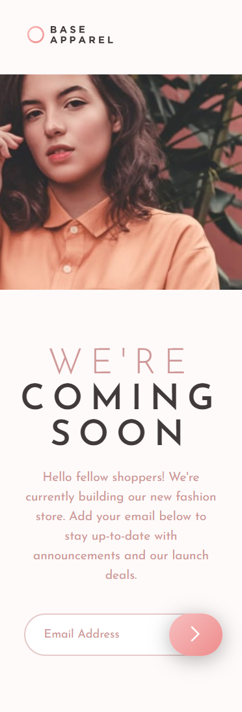

# 👗 Base Apparel Coming Soon

Projeto de página de anúncio de lançamento de e-commerce de moda, desenvolvido como parte de um desafio do **Frontend Mentor**. A página inclui validação de formulário em **JavaScript puro** e design responsivo conforme o layout proposto.

---

## 📌 Desafio

Criar uma página com base no layout fornecido pelo Frontend Mentor, incluindo:

- Layout responsivo (desktop e mobile);
- Validação do formulário com JavaScript puro;
- Mensagem de erro ao inserir um e-mail inválido ou vazio;
- Fundo com imagem e conteúdo centralizado na tela.

---

## ⚙️ Funcionalidades

- Verificação de e-mail ao clicar no botão de envio;
- Exibição de mensagem e ícone de erro caso o campo esteja vazio ou sem `@`;
- Mensagem de erro some ao perder o foco (blur) do campo;
- Layout adaptado para diferentes tamanhos de tela (media queries).

---

## 🛠️ Tecnologias Utilizadas

- **HTML5**
- **CSS3**
- **JavaScript (vanilla)**

---

## 🖼️ Resultado

### 🖥️ Desktop

### 📱 Mobile

---

## 🔗 Veja no GitHub Pages

🔗 [Clique aqui para visualizar o projeto](https://seu-usuario.github.io/seu-repositorio)